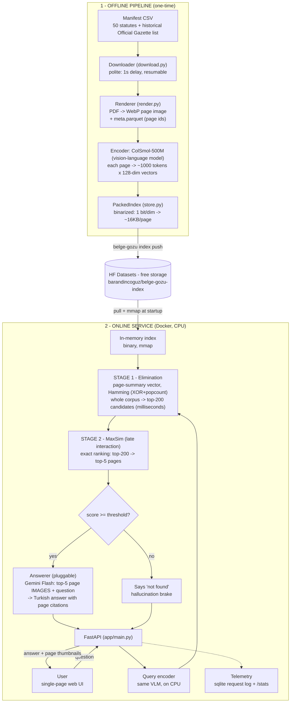

# Belge-Gözü

**Visual document RAG for Turkish legal documents — no OCR, no text parsing.**
Pages are indexed as *images*. A ColPali-class vision-language model retrieves the
right pages straight from pixels, and a swappable VLM answerer looks at those page
images and answers strictly from what it sees — citing pages, or admitting it doesn't
know — instead of hallucinating an article number.

v0 corpus: 4,222 pages across 50 core Turkish statutes (Anayasa, TBK, TCK, İş Kanunu,
KVKK, TTK, TMK, tax and finance law, and more) plus 6 historical Official Gazette scans
spanning 1928–1975.

## Live demo

**Status: pending — not created yet, by design, not by omission.** The retrieval index
and all 4,222 page images are already public on HF Datasets:
**[barandincoguz/belge-gozu-index](https://huggingface.co/datasets/barandincoguz/belge-gozu-index)**.
This repo already has everything a Space needs (`Dockerfile`, `pyproject.toml`, `src/`).
But as of this writing, Hugging Face requires a PRO subscription to create *any* Docker
or Gradio Space — even on the free `cpu-basic` tier — confirmed live via the Hub API
(`402 Payment Required`; only the fully-static SDK is free). This account doesn't have
PRO, so `barandincoguz/belge-gozu` hasn't been created yet rather than deployed and
guessed at. Creating and pushing it is one `huggingface_hub` call away once that's
resolved.

In the meantime, the whole system runs locally in a few minutes — see
[Quickstart](#quickstart) — against the exact same public index, no GPU required.
(Once live: free-tier Spaces sleep after inactivity, so expect ~1-2 min on first load.)

## How it works



Retrieval is two-stage: a cheap Hamming-distance pass over binarized page-summary
vectors narrows the whole corpus to ~200 candidates in milliseconds, then exact
late-interaction MaxSim (real ColPali-style scoring, not an approximation) re-ranks
those candidates to the top 5. If the best score doesn't clear a threshold, the service
returns "I couldn't find grounds for this in the corpus" *before* ever calling the LLM —
the abstain path costs nothing and can't hallucinate.

## Example queries

Real runs against the local server — the same code, model, and public index the Space
would run once deployed:

| Question | Result |
|---|---|
| *"Kişisel Verilerin Korunması Kanunu'na göre açık rızanın geçerlilik şartları nelerdir?"* (KVKK: conditions for valid explicit consent) | **Substantive, correctly cited.** Retrieval put the actual KVKK pages at rank 1-2; the answer states the three real statutory conditions (specific to a matter, based on being informed, freely given) with citations. |
| *"Katma Değer Vergisi Kanunu'na göre KDV oranını belirlemeye kim yetkilidir?"* (who sets the VAT rate) | **Clean abstain.** Top retrieval score fell under the threshold, so the service returned "no grounds found" without calling the LLM at all — the hallucination brake, working as intended, rather than a guess. |
| *"Türk Medeni Kanunu'na göre yerleşim yeri nasıl tanımlanır?"* (definition of legal domicile) | **Clean abstain**, same mechanism. |

Those are honestly representative, not the best 3 out of hundreds: across 17 varied
legal questions tried in this session (see [v0 limitations](#v0-limitations)), 1 produced
a fully substantive correct answer and 3 abstained cleanly; the rest got an honest "not
found in the given pages" from the answerer despite retrieval clearing the score gate.
Explicitly naming the statute in the question measurably helped ("KVKK'na göre..." beat
"KVKK ne der?"-style phrasing every time it was tried).

## Quickstart

```bash
make setup                  # dev deps: ruff, pyright, pytest
uv sync --all-extras        # + ml deps (torch, colpali-engine) — needed for index/serve
uv run belge-gozu --help

# serve straight from the published index + images (no local corpus needed)
BG_HF_DATASET_REPO=barandincoguz/belge-gozu-index BG_DEVICE=cpu \
  uv run belge-gozu serve --pull
# -> http://localhost:7860
```

To reproduce the corpus from scratch instead of pulling the published index:

```bash
uv run belge-gozu corpus download   # ~50 statutes + historical RG scans -> data/pdf/
uv run belge-gozu corpus render     # PDF -> WebP page images + data/meta.parquet
uv run belge-gozu index build       # ColSmol-500M embeddings -> data/index/ (packed, binary)
uv run belge-gozu index push        # optional: publish index/ + images/ to your own HF dataset repo
uv run belge-gozu serve
```

`GOOGLE_API_KEY` (or `BG_GEMINI_API_KEY`) must be set for `/ask` to call the answerer;
`/search` works without it.

## Telemetri

Every `/ask` and `/search` request is logged to `data/requests.sqlite` (stage-by-stage
latency — encode, Hamming pre-filter, MaxSim rerank, answerer — plus token counts,
estimated USD cost, and whether the request abstained) and mirrored as Prometheus
metrics on `GET /metrics` (`bg_*` series: request/stage duration histograms, abstain
and token counters, in-flight gauge, `bg_app_info`). `make obs-up` starts a local
Prometheus + Grafana (`http://localhost:3001`, anonymous access, dashboard `belge-gozu`
pre-provisioned) reading that endpoint; `make obs-down` tears it down.
`uv run belge-gozu metrics summary` prints a quick p95/abstain/cost readout from the
SQLite log; `uv run belge-gozu metrics export --out <path>.parquet` dumps the raw event
table for offline analysis. See `docs/research/` for a real baseline measurement session
(load test, live `/ask` calls, and an honest write-up including a concurrency crash
found while running it).

## v0 limitations

This is a working end-to-end system, not a finished product — v0's known gaps, honestly:

- **Retrieval precision on natural-language queries is the weak link, not answer
  honesty.** In this session's own live testing, correct-law pages sometimes ranked
  just outside the top-5 window (or well outside it) even though the relevant statute
  is in the corpus; the answerer and the score-threshold abstain both behaved correctly
  every time (no fabricated citations observed), but a narrow top-5 with no reranking
  means real answers get missed. Query rewriting and a VLM reranking pass are planned
  next, along with a proper retrieval benchmark (v0 has none — the numbers above are a
  qualitative session log, not a scored eval).
- **The score threshold (`BG_MIN_SCORE_THRESHOLD=60.0`) is a rough calibration** from a
  handful of observed scores, not a tuned operating point.
- **Single retrieval mode, single answerer.** No query rewriting, no agentic
  multi-step retrieval, no local-VLM fallback — Gemini Flash is the only answerer
  implemented, behind a pluggable `Answerer` protocol.
- **50 statutes, not the full corpus of Turkish law.** Scoped deliberately for v0;
  broader coverage is a later-phase concern once retrieval quality is solid enough
  to be worth scaling.
- **Space hosting is pending**, per [Live demo](#live-demo) above — a platform
  billing gate discovered during this deployment, not a code or infra gap.

## Data & license

Corpus text and images are rendered from official Turkish statutes and Official
Gazette (Resmî Gazete) publications. Turkish official texts (laws, regulations,
court decisions, and other public documents issued by government bodies) are exempt
from copyright protection under **FSEK (Fikir ve Sanat Eserleri Kanunu) art. 31**.
Source URLs for every document are recorded in `data/manifest/v0_manifest.csv` and in
`meta.parquet`'s `source_url` column.

## Tech stack

Python 3.12 · FastAPI + uvicorn · PyMuPDF (PDF -> image rendering, no OCR) ·
colpali-engine / ColSmol-500M (visual late-interaction retrieval) · PyTorch (MPS/CUDA/CPU) ·
NumPy (binary-packed index, memory-mapped) · Gemini API via `google-genai` (pluggable
answerer) · Hugging Face Hub (dataset storage + Space hosting) · pandas/pyarrow ·
pytest + ruff + pyright, enforced in CI.
