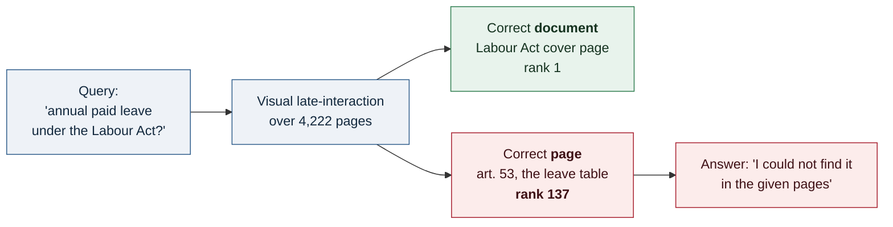
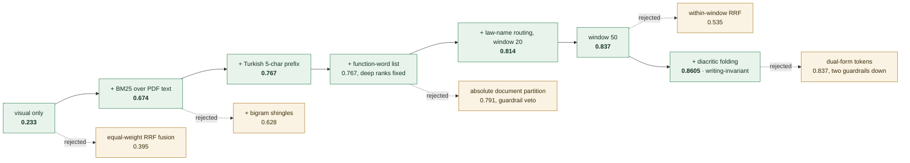
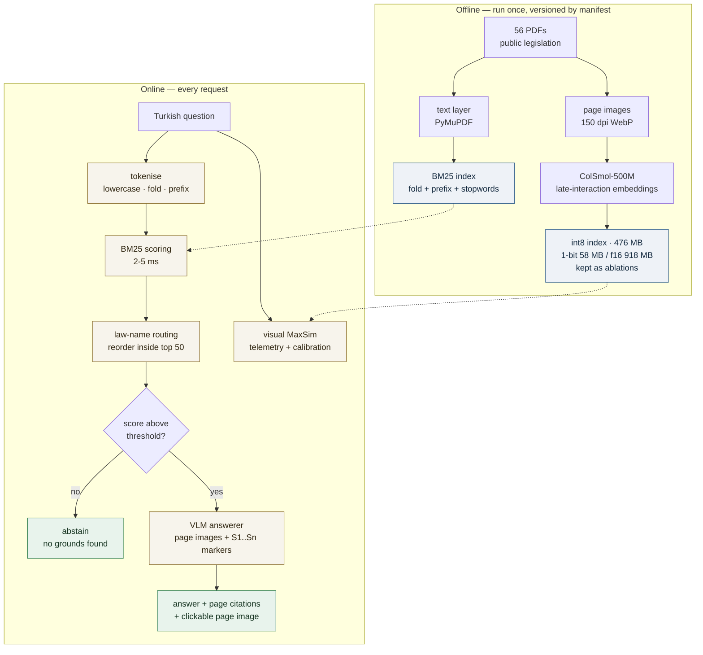

# Belge-Gözü

[](https://github.com/barandincoguz/belge-gozu/actions/workflows/ci.yml)

**Grounded question answering over 4,222 pages of Turkish legislation — built measurement-first.**

Ask a question in plain Turkish. The system finds the page that actually contains the
answer, reads it, answers from it, and cites the page — or says it could not find one.
Every design decision below is a measured number, **including the ones that failed and
were thrown away.**

| | |
|---|---|
| **Corpus** | 4,222 pages · 56 documents (50 statutes + 6 scanned *Resmî Gazete* issues, 1928–1975) |
| **Retrieval quality** | Recall@5 **0.8605** (37/43) · Recall@20 0.930 — identical with and without Turkish diacritics |
| **Starting point** | Recall@5 **0.116** on the same benchmark |
| **Latency** | text retrieval 2–5 ms · end-to-end answer 6–24 s (LLM-bound) |
| **Engineering** | 667 tests · CI runs the suite **and** builds the deployment image · every number traceable to a dated run artefact |
| **Stack** | Python 3.12 · FastAPI · PyTorch · Transformers · ColPali-class vision encoder · BM25 (hand-written) · SQLite · Prometheus · Grafana · Docker · GitHub Actions · pytest · ruff · pyright · uv |

Index and all page images are public on Hugging Face Datasets:
**[barandincoguz/belge-gozu-index](https://huggingface.co/datasets/barandincoguz/belge-gozu-index)**.

---

## 1. Purpose

Turkish legislation is public but practically unsearchable. The text lives in PDFs whose
layout carries meaning — article numbers, tariff tables, marginal notes, gazettes scanned
from 1928. Keyword search returns the law but not the *page*; a general chatbot returns a
fluent article number that does not exist.

Belge-Gözü is built for the opposite failure mode: **it would rather say "I could not find
it" than invent an article.** Answers are produced only from retrieved pages, each claim
carries a page citation, and the page image is shown so a human can check it.

The project is also an argument about method. Nothing is claimed without a number, every
number carries its provenance (which index, which corpus checksum, which commit), and
rejected experiments stay in the repository with their measurements intact.

## 2. Problem

The first working version retrieved page *images* with a ColPali-class vision-language
model — late-interaction MaxSim over page screenshots, no OCR, no layout parsing. It
looked right and measured wrong.



The model matched the law's *identity* — its title page — and lost the article. The honest
"could not find it" was correct behaviour on wrong evidence. Measured, the failure was
unambiguous: **Recall@5 = 0.116**, and the domicile-definition page a user would expect
first sat at rank 3127 of 4222.

Root cause, once measured rather than guessed: the encoder is trained predominantly on
English, and a long Turkish legal query aligns with a document's *name* far more strongly
than with an article's body text.

## 3. Engineering map

Each step is one controlled experiment: one variable changed, one primary metric
(Recall@5 over a 43-question benchmark), a frozen harness, and a keep-or-revert decision.
**Dashed branches were measured and rejected** — the part most portfolios delete.



Three results worth stating plainly, because each contradicts the obvious approach:

**Reciprocal Rank Fusion made things worse — three times.** The textbook move is to fuse
the visual and text rankings. Equal-weight RRF dropped Recall@5 from 0.674 to 0.395;
absolute document partitioning failed a guardrail; within-window RRF gave 0.535. The weak
channel's title-page attraction outranks the strong channel's real hits at every
granularity tried. What survived is lexical-primary ranking with a rule-based re-order.

**The visual channel contributes zero unique top-5 hits** once the text channel is tuned.
It still runs on every query — it feeds telemetry and the calibration dataset, and it is
the fallback for the 16 pages with a weak text layer — but it no longer ranks. That is the
honest result, not the one that fits the original pitch.

**Diacritics were a production bug, not a nicety.** Turkish keyboards are routinely
bypassed: users type *"yillik ucretli izin"*. Measured, that collapsed Recall@5 from 0.837
to 0.581. Folding diacritics on both the index and the query side makes the system
**writing-invariant** — 0.8605 in both conditions.

## 4. Architecture



Two rules hold the system together:

**Identity travels with data.** Every index carries a manifest — model revision, query
format, document-prompt hash, quantisation, corpus checksum. The server refuses to start
against an index whose identity does not match its configuration, and the calibration
artefact is keyed by `index_revision × pipeline × recipe_fingerprint`. This discipline came
out of an audit that found 139 places where a value had drifted from the context that gave
it meaning — the worst being a score threshold silently bound to one quantisation scheme.

**Flags and rollback.** New decision layers (calibrated gate, evidence verifier) ship behind
flags that default to off, with a test asserting the served behaviour is byte-identical
while they are off.

## 5. Technical detail

### Retrieval

| Configuration | Recall@5 | Recall@20 | MRR | Gold-page rank, query A / B |
|---|---|---|---|---|
| visual only, 1-bit (original) | 0.116 | — | — | 3127 / — |
| visual only, int8 | 0.233 | 0.302 | 0.149 | 664 / 137 |
| hybrid, before folding | 0.837 | 0.930 | 0.655 | 2 / 2 |
| **hybrid + folding (shipped)** | **0.8605** | **0.930** | 0.632 | **2 / 2** |

Robustness sweep: BM25 `k1` ∈ [0.9, 1.8] × `b` ∈ [0.5, 0.9] all land in 0.814–0.837, and
prefix length 4–7 is a plateau — the recipe is not balanced on a knife edge. One tuning
setting would have added a further question and was deliberately **not** taken: that is
fitting the benchmark, not the problem.

### Quantisation

int8 matches float16 ranking quality at every k, runs 4.3× faster than 1-bit (0.24 s vs
1.08 s per query on CPU), and costs 476 MB against 58 MB. 1-bit loses 7 points of Recall@20
*and* is slower — bit-packing tricks lose to BLAS here. int8 ships; the others stay as
reproducible ablations.

### Answer path

Page markers are interleaved with images (`[S1]`, image, `[S2]`, image, …) so a citation
binds to a specific page rather than a positional guess. There is no auto-citation
fallback: if the model emits no marker, the answer carries none. Failures are classified
(`timeout`, `http_5xx`, `http_429`, `auth`, `safety_block`, `parse`), and a total time
budget is enforced as an invariant — a retry may not start if the remaining budget cannot
cover it. Two API keys rotate: any transport-level error moves the request to the other key,
and the working key becomes sticky.

### Selective answering (in progress)

The abstain threshold is a **mechanical transfer** of a prior operating point onto the BM25
scale, not a calibration — and it does not separate answerable from unanswerable questions.
Measured, moving the number does not fix that:

- A confidence model over five retrieval-side features reaches AUROC 0.782 on the
  development split, but at a 5% risk budget it answers only 2.2% of questions.
- Signals that looked strong against 5 unanswerable questions (AUC 0.94) fell to 0.68
  against 151 realistic ones — the new negatives are lexically plausible.

Stated as a finding rather than a plan: **retrieval-side confidence alone cannot carry
selective answering here.** A claim-level evidence verifier — segment the answer, check each
claim against its cited page text, demote the answer if any claim is unsupported — is built
and tested behind a flag. Wiring it into the default path is the next milestone.

### Benchmarks and their provenance

- **Canary**: 48 questions (43 answerable), behind every retrieval decision above.
- **Unanswerable set**: 330 questions in three classes — out-of-corpus, nonsense, and the
  hard one: *about* a corpus law, but the specific detail genuinely is not in the text.
- Labels come from a drafter ≠ checker regime. Mechanical labels ("the anchored law is
  absent from the 56-document manifest") are re-verified by a script that runs in CI. A
  sampled cross-check put residual label noise at 12.5%, after which the entire test side
  was verified row by row with an evidence quote for every rejection.
- The split is law-grouped: 22 of 56 documents are test-only. The test side holds 155
  unanswerable questions — the size at which a zero-error result supports a ≤2% claim at
  95% confidence.

**Honesty note, repeated wherever these numbers appear:** 3 of the 48 canary rows were
verified by a human; the other 45 and the whole unanswerable set were verified by model
cross-check. **These are not human-validated benchmarks.**

### Operations

A SQLite event log (29 fields per request — pipeline, score scale, which API key served,
whether the model reported an honest miss), a Prometheus endpoint and a provisioned Grafana
dashboard. Input validation rejects empty, overlong and malformed queries; a per-IP rate
limiter with eviction and a privacy default that keeps raw query text off disk are both
enabled in the container image.

CI runs lint, type-check, 667 tests and the benchmark-integrity validator, and separately
builds the deployment image. Its first two runs were red — catching two portability bugs
that 147 local commits had not: CLI assertions that depended on terminal colour, and a
corpus manifest the validator needs that was never tracked.

## 6. Closing

**What works today.** Retrieval is solved to the point where the remaining errors are
semantic rather than lexical: the six unsolved benchmark questions are pure paraphrases
sharing no vocabulary with their target pages. The system answers with citations, abstains
on nonsense, tolerates missing diacritics, and survives an exhausted API quota by rotating
keys.

**What is honestly unfinished.**

| Area | Status |
|---|---|
| Selective answering | Confidence model built and measured; too conservative to enable. Verifier built, behind a flag. |
| Formal gate reports | Phase 0 passed and documented. Phase 1 has two measured failures (Recall@50 0.930 against a 0.95 target; paraphrase slice 0.571) **not yet adjudicated in a report**. |
| Human validation | 3 of 48 rows. A human-gated benchmark is the honest next step. |
| Public deployment | Runs locally; hosting needs a paid tier. The image builds in CI but has never been deployed. |
| Article structure & OCR | Article-level hierarchy was specified but never built; 16 pages have a weak text layer and no OCR fallback. |

All of it is tracked as issues in this repository — the failures included, filed rather
than footnoted.

**What this project argues.** The interesting part was not the model. It was building a
measurement apparatus honest enough to overturn its own design: a visual-retrieval project
whose measurements said the visual channel should stop ranking, a fusion strategy rejected
three times on evidence, and a confidence model whose own numbers said it was not ready to
ship. The runs behind those calls are in `docs/research/findings/`, dated, with the raw
artefacts beside them.

---

### Run it

```bash
uv sync --extra dev --extra ml          # locked dependencies
uv run belge-gozu corpus download       # public PDFs
uv run belge-gozu corpus render         # PDF -> page images
uv run belge-gozu index build           # embeddings (GPU/MPS recommended)
uv run belge-gozu index derive --quant int8
uv run belge-gozu index build-text      # text-channel artefact
uv run belge-gozu serve --port 7860     # http://localhost:7860
```

Requires `GOOGLE_API_KEY` (optionally `GOOGLE_API_KEY_2` for rotation) in `.env`.
Tests: `make test` · lint and types: `make lint` · dashboards: `make obs-up`.

### Repository map

| Path | What is in it |
|---|---|
| `src/belge_gozu/retrieval/` | BM25 text channel, law-name routing, hybrid retriever |
| `src/belge_gozu/index/` | encoding, quantisation, manifests, compatibility fail-fast |
| `src/belge_gozu/answer/` | answerer, key rotation, calibration, claim verifier |
| `src/belge_gozu/telemetry/` | event log, Prometheus metrics, stage timing |
| `docs/research/findings/` | dated measurement notes — the reasoning behind every number here |
| `research/` | the experiment loop: journal, harness, results |
| `data/bench/` | benchmarks, splits, and their provenance READMEs |
