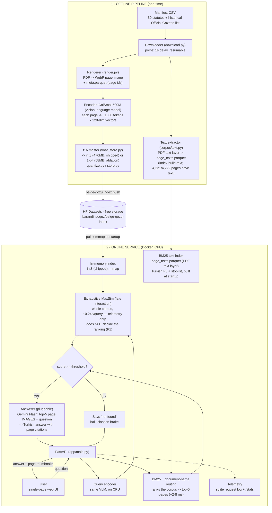

# Belge-Gözü

**Hybrid document RAG for Turkish legal documents — no OCR.**
Pages are indexed as *images* by a ColPali-class vision-language model, and a swappable
VLM answerer looks at those page images and answers strictly from what it sees — citing
pages, or admitting it doesn't know — instead of hallucinating an article number.
Retrieval was visual-only in v0/P0; **P1 measured that channel against a Turkish-tuned
BM25 pass over the PDF text layer and the text channel won by 3.5x** (canary Recall@5
0.233 → 0.814), so ranking is now hybrid. The visual channel still runs on every query,
kept for telemetry and P2 calibration — the honest result, not the one that fit the
original pitch.

v0 corpus: 4,222 pages across 50 core Turkish statutes (Anayasa, TBK, TCK, İş Kanunu,
KVKK, TTK, TMK, tax and finance law, and more) plus 6 historical Official Gazette scans
spanning 1928–1975.

## Live demo

**Status: pending — not created yet, by design, not by omission.** The retrieval index
and all 4,222 page images are already public on HF Datasets:
**[barandincoguz/belge-gozu-index](https://huggingface.co/datasets/barandincoguz/belge-gozu-index)**.
This repo already has everything a Space needs (`Dockerfile`, `pyproject.toml`, `src/`).
But as of this writing, Hugging Face requires a PRO subscription to create *any* Docker
or Gradio Space — even on the free `cpu-basic` tier — confirmed live via the Hub API
(`402 Payment Required`; only the fully-static SDK is free). This account doesn't have
PRO, so `barandincoguz/belge-gozu` hasn't been created yet rather than deployed and
guessed at. Creating and pushing it is one `huggingface_hub` call away once that's
resolved.

In the meantime, the whole system runs locally in a few minutes — see
[Quickstart](#quickstart) — against the exact same public index, no GPU required.
(Once live: free-tier Spaces sleep after inactivity, so expect ~1-2 min on first load.)

## How it works



**Retrieval is hybrid (P1 default).** Ranking is decided by a **BM25 text channel** over
the PDF text layer, with Turkish-specific handling measured one step at a time: `İ/I`-aware
lowercasing, a fixed Turkish function-word stoplist applied before stemming, F5 prefix
truncation (first 5 characters — Turkish is agglutinative), and a **document-name routing**
pass that re-orders *only inside* the BM25 top-20 window when every non-generic token of a
statute's own title (derived from its page-1 heading, so no hand-written name table and no
benchmark leakage) appears in the query. The visual MaxSim channel still runs on every
query but no longer decides the ranking — it is kept for telemetry and as the input to P2
calibration (both channels' top-1 scores are logged side by side in
`detail.retrieval`). Measured on the same 43 answerable canary questions
(`research/journal.md`, [findings](docs/research/findings/2026-08-29-autoresearch-text-channel.md)):

| pipeline | Recall@5 | Recall@20 | MRR | demo chip 1 gold rank | demo chip 2 gold rank |
|---|---|---|---|---|---|
| visual only (P0, exhaustive int8) | 0.233 | 0.302 | 0.149 | 664 / 4222 | 137 / 4222 |
| **hybrid (P1, shipped)** | **0.814** | **0.907** | **0.652** | **2** | **2** |

Two negative results are part of that recipe and are worth as much as the positive one:
**equal-weight RRF fusion of the two channels made things worse** (0.674 → 0.395 — the weak
channel's cover-page noise sank the strong channel's wins), and after F5 truncation the
visual channel contributed **zero unique top-5 questions**. Latency-wise BM25 is
negligible — ~2-8 ms/query on 4,222 pages, against ~0.24 s for the visual channel it runs
alongside — and building the BM25 index at startup takes ~0.4 s (one-off, after the
`page_texts.parquet` artifact is built by `belge-gozu index build-text`).
The visual-only path remains available as an ablation (`BG_RETRIEVAL_PIPELINE=exhaustive`)
— **but the threshold does not come with it**, see below.

The visual channel itself is exhaustive: every query is scored against the whole corpus with
late-interaction MaxSim — no elimination pass — which takes ~0.24 s/query over the
current 4,222-page int8 index (CPU, idle machine). An earlier two-stage design first narrowed the corpus to ~200 candidates with
a cheap mean-sign Hamming filter before re-ranking with MaxSim; that filter turned out
to be discarding good candidates (see [v0 limitations](#v0-limitations)) and was
removed from the production path — it survives only as an ablation option
(`BG_RETRIEVAL_PIPELINE=two-stage`, which needs the 1-bit index). Any quantized
index approximates native float ColPali scoring, and the P0 plan's quantization ablation (C1/C2: float16 oracle vs.
int8 vs. 1-bit) has now been run on the 48-question canary benchmark (43 answerable;
**not a human-validated set** — see the caveat below, so treat these numbers as
provisional), in the production query/document format: **int8 matches float16 exactly
at every k** (Recall@1/5/20/50/200 all identical); **1-bit loses 7.0 points of
Recall@20** relative to float16 (0.233 vs. 0.302). 1-bit is also **slower, not
faster**: scoring all 4,222 pages against a 40-token query takes 1.08 s at 1-bit vs.
0.24 s at int8 vs. 0.08 s at float16 (CPU, idle machine), because int8/float16 hit a
BLAS matmul path while the 1-bit path builds large temporaries for the popcount
reduction. Index size is the one axis where 1-bit still wins (58 MB vs. 476 MB for
int8 vs. 918 MB for float16). **int8 is now what ships**: serving was the only missing
piece (the retriever previously accepted the packed 1-bit index only), and it is now
representation-agnostic, so the measured winner is also the served one. 1-bit remains
available as the ablation / disk-budget option (`data/index-traincompat-1bit`, 58 MB)
via `BG_INDEX_DIR`. Full tables:
[`docs/research/findings/2026-08-27-p0-baseline.md`](docs/research/findings/2026-08-27-p0-baseline.md)
and
[`docs/research/findings/2026-08-27-p0-gate.md`](docs/research/findings/2026-08-27-p0-gate.md).
Separately, the single biggest P0 result to date: switching the document encoder to
the checkpoint's training-time prompt (instead of the format `colpali-engine==0.3.18`
emits by default) raised float16 Recall@5 from 0.093 to 0.233 on that same
canary set.

**Benchmark provenance caveat (applies to every canary number on this page).** The
canary questions were drafted by model agents reading the page images; of the 48 rows,
only **3 were verified by a human** — the other 45 were checked by an independent model
pass that re-read the same images (`verification_kind: "model-cross-check"`). That pass
was not a rubber stamp (it found 5 label/evidence corrections and one real page-span
error, `c213`), but a model-verified benchmark **cannot be cited as human-validated**,
and because the verifying model is the same family that drafted the questions,
correlated blind spots are possible. Full provenance, limitations and the list of
defects found: [`data/bench/canary_v1.README.md`](data/bench/canary_v1.README.md).

The score that reaches the abstain gate is itself an **uncalibrated similarity** — under the
hybrid default it is a raw **BM25 score** (unbounded; answerable canary top-1s run min 10.53 /
median 26.05 / max 69.30), not a confidence or probability. If it doesn't clear a threshold,
the service returns "I couldn't find grounds for this in the corpus" *before* ever calling
the LLM — the abstain path costs nothing and can't hallucinate. The threshold
(`BG_MIN_SCORE_THRESHOLD=10.6`) is a **mechanical transfer** of the previous int8 `0.58`
(itself a transfer of the older binary-scale `60.0`) onto the BM25 scale: it reproduces the
same operating point *by count* — 42 of 43 answerable and 4 of 5 unanswerable canary
questions clear it, exactly as before — which makes it a unit change, not a recalibration.
The band of thresholds giving that operating point is `(10.528, 10.712]`; 10.6 is picked
from inside it. It is therefore still uncalibrated and still non-separating (see
[v0 limitations](#v0-limitations)); real calibration is P2 work.

**The threshold's scale is tied to the pipeline, not to the index representation.** Switching
to `BG_RETRIEVAL_PIPELINE=exhaustive` (or the two-stage ablation) puts scores back on the
normalized [-1, 1] MaxSim band, where 10.6 can never be cleared and the service would abstain
on everything; the P0 value for that band was `0.58`, and even there it was int8-specific
(on the 1-bit index the same questions score 0.4676-0.6133, so 0.58 clears only 1 of 43).
The server **fails fast** at startup on an out-of-band threshold in either direction, and logs
a warning when the active pipeline's scale differs from the one the threshold was transferred
on.

## Example queries

> **Stale — these rows describe the v0 pipeline and are kept for the record only.**
> They were logged before the P0 work replaced the retrieval path (Stage-1 removed,
> training-compatible prompt format adopted, index rebuilt). Both the ranks and the
> abstain outcomes below have since changed, and the "clean abstain" reading in
> particular no longer holds — see the measured threshold behaviour in
> [v0 limitations](#v0-limitations). They will be re-measured against the current
> pipeline before any public claim is made.

Runs against the local server, v0 pipeline, before the P0 changes:

| Question | Result (v0, superseded) |
|---|---|
| *"Kişisel Verilerin Korunması Kanunu'na göre açık rızanın geçerlilik şartları nelerdir?"* (KVKK: conditions for valid explicit consent) | **Substantive, correctly cited.** Retrieval put the actual KVKK pages at rank 1-2; the answer states the three real statutory conditions (specific to a matter, based on being informed, freely given) with citations. |
| *"Katma Değer Vergisi Kanunu'na göre KDV oranını belirlemeye kim yetkilidir?"* (who sets the VAT rate) | **Abstained** — the top score fell under the 60.0 threshold. Read at the time as the hallucination brake working; the P0 measurements show the threshold does not actually separate answerable from unanswerable questions, so this outcome cannot be credited to a working brake. |
| *"Türk Medeni Kanunu'na göre yerleşim yeri nasıl tanımlanır?"* (definition of legal domicile) | **Abstained**, same mechanism — and this is the query P0 used as its root-cause probe: the correct page (`k4721:4`) was ranked 3127/4222 by the old Stage-1, then 1221 (1-bit) and 664 (int8) under exhaustive MaxSim. Under the shipped hybrid pipeline it ranks **2**. |

Those were honestly representative of v0, not the best 3 out of hundreds: across 17 varied
legal questions tried in that session (see [v0 limitations](#v0-limitations)), 1 produced
a fully substantive correct answer and 3 abstained; the rest got an honest "not
found in the given pages" from the answerer despite retrieval clearing the score gate.
Explicitly naming the statute in the question measurably helped ("KVKK'na göre..." beat
"KVKK ne der?"-style phrasing every time it was tried) — a hint, in hindsight, of the
query-format problem P0 later found and fixed.

## Quickstart

```bash
make setup                  # dev deps: ruff, pyright, pytest
uv sync --all-extras        # + ml deps (torch, colpali-engine) — needed for index/serve
uv run belge-gozu --help

# serve straight from the published index + images (no local corpus needed)
# serves data/index-traincompat-int8 by default (int8, 476 MB — see BG_INDEX_DIR)
BG_HF_DATASET_REPO=barandincoguz/belge-gozu-index BG_DEVICE=cpu \
  uv run belge-gozu serve --pull

# the hybrid (default) pipeline also needs the BM25 text-channel artifact,
# extracted from the corpus PDFs into <BG_INDEX_DIR>/page_texts.parquet.
# No model, no GPU, ~9 s for 4,222 pages -> 5.5 MB:
uv run belge-gozu corpus download    # only if you don't have data/pdf/ yet
uv run belge-gozu index build-text
# -> http://localhost:7860
```

Serving refuses to start with `BG_RETRIEVAL_PIPELINE=hybrid` (the default) if that file is
missing or is not row-for-row aligned with the index's `page_ids.json` — a silent fallback to
visual-only retrieval would quietly give up the measured recipe.

To reproduce the corpus from scratch instead of pulling the published index:

```bash
uv run belge-gozu corpus download   # ~50 statutes + historical RG scans -> data/pdf/
uv run belge-gozu corpus render     # PDF -> WebP page images + data/meta.parquet
uv run belge-gozu index build --precision f16 --out data/index-traincompat-f16
                                   # ColSmol-500M embeddings -> f16 master (918 MB)
uv run belge-gozu index derive --from data/index-traincompat-f16 \
  --quant int8 --out data/index-traincompat-int8      # what serving loads (476 MB)
uv run belge-gozu index build-text  # BM25 text channel -> <index>/page_texts.parquet
uv run belge-gozu index push        # optional: publish index/ + images/ to your own HF dataset repo
uv run belge-gozu serve
```

`GOOGLE_API_KEY` (or `BG_GEMINI_API_KEY`) must be set for `/ask` to call the answerer;
`/search` works without it.

## Telemetri

Every `/ask` and `/search` request is logged to `data/requests.sqlite` (stage-by-stage
latency — query encode, exhaustive MaxSim, answerer — plus token counts, estimated USD
cost, and whether the request abstained) and mirrored as Prometheus
metrics on `GET /metrics` (`bg_*` series: request/stage duration histograms, abstain
and token counters, in-flight gauge, `bg_app_info`). `make obs-up` starts a local
Prometheus + Grafana (`http://localhost:3001`, anonymous access, dashboard `belge-gozu`
pre-provisioned) reading that endpoint; `make obs-down` tears it down.
The event table's `stage1_ms`/`stage2_ms` columns are a leftover of the removed
two-stage pipeline and stay `NULL` under the default (`hybrid`) one — the hybrid stages'
latencies are recorded in the event's `detail.stages` map (`exhaustive_maxsim`,
`text_bm25`, `route_fuse`) and exported to Prometheus in `bg_stage_duration_seconds`.
Because the hybrid pipeline scores on the BM25 scale, its top-score/margin samples go to
separate `bg_retrieval_top_score_bm25` / `bg_retrieval_score_margin_bm25` histograms rather
than mixing into the normalized `[-1, 1]` series (see `docs/research/metrics-catalog.md`).
`uv run belge-gozu metrics summary` prints a quick p95/abstain/cost readout from the
SQLite log; `uv run belge-gozu metrics export --out <path>.parquet` dumps the raw event
table for offline analysis. See `docs/research/` for a real baseline measurement session
(load test, live `/ask` calls, and an honest write-up including a concurrency crash
found while running it).

## v0 limitations

This is a working end-to-end system, not a finished product — v0's known gaps, honestly:

- **Retrieval precision on natural-language queries was the weak link — P1 fixed most of
  it, and the remaining misses are known.** The hybrid text channel took canary Recall@5
  from 0.233 to 0.814, but 8 of 43 questions still miss the top-5: article-number queries
  ("madde 7", `c214` — no article-number channel yet), abbreviation queries (`c206`, "KVKK"
  is never spelled out in the title, so document-name routing can't fire), a partial-title
  case (`c209`, Anayasa), and one question the visual channel used to win alone (`c202`)
  that the text-only recipe loses — a deliberate, measured cost of not fusing the channels.
  No query rewriting and no reranking pass yet.
- **The score threshold (`BG_MIN_SCORE_THRESHOLD=10.6`) is a mechanical scale transfer,
  not a calibration** — and it still does not separate answerable from unanswerable
  questions. It reproduces the previous operating point by count (42/43 answerable and
  4/5 unanswerable questions clear it, exactly as under 0.58 and 60.0 before it) — a unit
  change on a new score scale, not a recalibration. Measured on the canary set (2026-08-29,
  production int8 index + hybrid pipeline; 3/48 rows human-verified, 45 model-cross-checked
  — see the provenance caveat above): answerable BM25 top-1 scores run min 10.53 /
  median 26.05 / max 69.30, while the out-of-corpus ones land at 23.53 / 12.96 / 17.86 and
  a nonsense-question control at 15.54 — three real out-of-corpus questions sit *above* the
  threshold, i.e. the distributions overlap and no single cut-off splits them. (Only the
  fully-gibberish control, 4.23, falls below.) Raising the threshold would just abstain on
  real questions instead: the answerable band starts at 10.53. Proper calibration is P2
  work; the current state is pinned by an `xfail(strict=True)` canary test so it can
  neither rot further nor be quietly declared fixed.
- **P0 root-cause investigation found the old two-stage Stage-1 filter was discarding
  good candidates, not just approximating the ranking.** For the query *"Türk Medeni
  Kanunu'na göre yerleşim yeri nasıl tanımlanır?"*, the correct page (`k4721:4`) ranked
  3127/4222 under the old mean-sign Hamming Stage-1 filter but 1576/4222 under
  exhaustive binary MaxSim; for *"Yerleşim yeri nedir?"* it ranked 1768 under Stage-1
  but **2** under exhaustive. Stage-1's top-200 candidate set overlapped the exhaustive
  top-200 by only 11.5-19% across the queries checked — it was picking a mostly
  different set of pages, not a faster version of the same ranking. Separately, the
  index was found to contain 3,960 all-zero padding-token rows across 15 pages — a
  real correctness defect (padding embeddings collapsing to an all-zero bit vector and
  scoring as if it were a genuine token). This is now fixed and locked:
  `PackedIndex.build` rejects all-zero rows at build time, and the rebuilt index has
  0 such rows: 3,776,882 tokens in the same (cpe-0.3.18) format as the old index —
  exactly 3,960 fewer than its 3,780,842 — and 3,759,994 in the train-compat format
  that ships today. It was **not**, however, one of the causes of today's poor retrieval
  numbers: measured on the canary benchmark (3/48 rows human-verified, 45
  model-cross-checked — see the provenance caveat above), an
  index rebuilt in the same format without the padding rows produced byte-identical
  Recall at every k and an identical top-20 list for 42 of the 43 questions versus the
  old, padded index. Independently, the encoder's retrieval training data is
  English-only, which is the likely reason Turkish paraphrase queries score weaker
  than queries that name the statute explicitly. That diagnosis is what P1 acted on:
  the text channel now ranks, and the same query's gold page moved from 664 to **2**.
- **Single retrieval mode, single answerer.** No query rewriting, no agentic
  multi-step retrieval, no local-VLM fallback — Gemini Flash is the only answerer
  implemented, behind a pluggable `Answerer` protocol.
- **50 statutes, not the full corpus of Turkish law.** Scoped deliberately for v0;
  broader coverage is a later-phase concern once retrieval quality is solid enough
  to be worth scaling.
- **Space hosting is pending**, per [Live demo](#live-demo) above — a platform
  billing gate discovered during this deployment, not a code or infra gap.

## Data & license

Corpus text and images are rendered from official Turkish statutes and Official
Gazette (Resmî Gazete) publications. Turkish official texts (laws, regulations,
court decisions, and other public documents issued by government bodies) are exempt
from copyright protection under **FSEK (Fikir ve Sanat Eserleri Kanunu) art. 31**.
Source URLs for every document are recorded in `data/manifest/v0_manifest.csv` and in
`meta.parquet`'s `source_url` column.

## Tech stack

Python 3.12 · FastAPI + uvicorn · PyMuPDF (PDF -> image rendering + text-layer extraction
for the BM25 channel; no OCR) ·
colpali-engine / ColSmol-500M (visual late-interaction retrieval) · PyTorch (MPS/CUDA/CPU) ·
NumPy (int8 index, memory-mapped) · Gemini API via `google-genai` (pluggable
answerer) · Hugging Face Hub (dataset storage + Space hosting) · pandas/pyarrow ·
pytest + ruff + pyright, enforced in CI.
