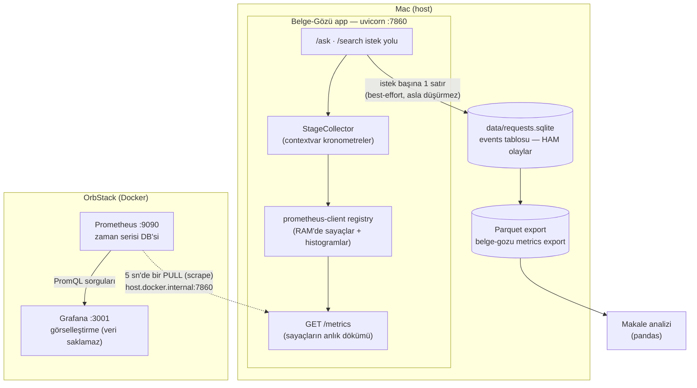
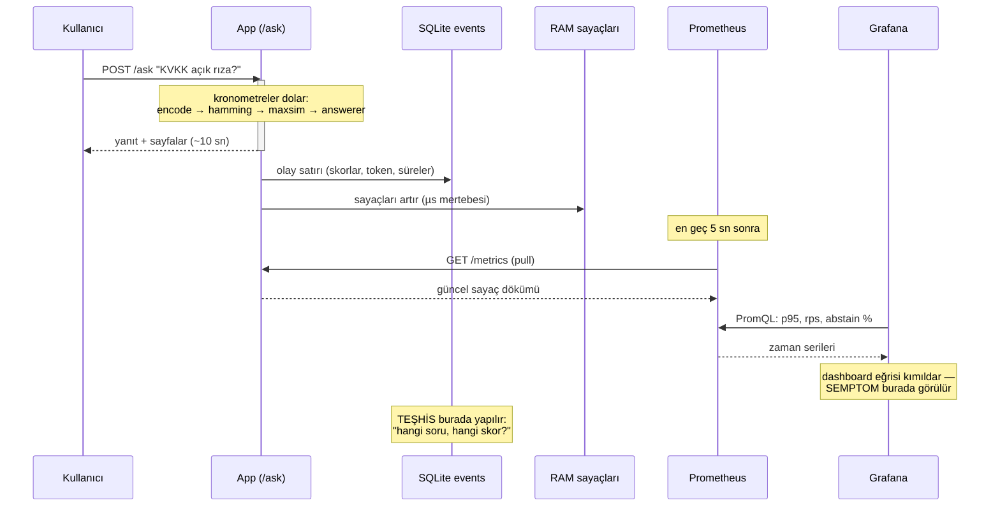

# Gözlem Katmanı Mimarisi — Prometheus ve Grafana Sistemin Neresinde?

> Eğitici bir sistem-tasarımı okuması: her parçanın yeri, işi ve çözdüğü problem.
> Metrik sözlüğü için [metrics-catalog.md](metrics-catalog.md), işletme adımları için
> [runbook.md](runbook.md).

## Büyük resim

Kritik tasarım gerçeği: **uygulama kimseye hiçbir şey göndermez.** İki pasif çıkışı
vardır — diske ham olay yazar ve `/metrics`'te bir metin sayfası yayınlar. Prometheus
ve Grafana tamamen dışarıdan bakan gözlemcilerdir; ikisi de kapalıyken uygulama
eksiksiz çalışır (HF Space tek-konteyner kısıtının gereği, spec §2/Q2).



## Parça parça: kim, nerede, hangi problemi çözüyor

### 1. Uygulama içi sayaçlar (`telemetry/prom.py` + `prometheus-client`)

İstek işlenirken RAM'deki sayaçlar artar (`bg_http_requests_total`), süreler histogram
"kovalarına" düşer. Çözdüğü problem: **istek yolunda sıfıra yakın maliyet.** Ne ağ
çağrısı ne disk — birkaç tamsayı artışı. "Telemetri isteği asla düşürmez" ilkesinin
(spec §3) fiziksel temeli budur.

Histogramın numarası: her gecikmeyi saklamak yerine önceden seçilmiş eşiklerde
(`0.05s … 30s`) kaç gözlem düştüğünü sayar. p95 sonradan `histogram_quantile()` ile bu
kovalardan *yaklaşık* hesaplanır — ucuzluk/doğruluk takasıdır ve düşük örneklem
sayısında sapabilir (2026-08-26 baseline notundaki 7.50 vs 6.81 token/sn farkı tam bu
artefakttır; ham değer esastır).

### 2. `GET /metrics` endpoint'i (`app/main.py`)

"Şu andaki sayaçların dökümü" olan düz metin sayfası. Çözdüğü problem: **standart
sözleşme.** Prometheus exposition formatı endüstri standardıdır; yarın Datadog'a veya
bir OpenTelemetry collector'a geçilse aynı sayfa okunur. Uygulama, kendisini kimin
izlediğini bilmez ve bilmemelidir.

### 3. Prometheus (Docker konteyneri, `:9090`)

Her 5 saniyede `/metrics`'i **çeker** (pull) ve her seriyi zaman damgasıyla kendi
zaman-serisi veritabanına ekler. Çözdüğü iki problem:

- **Zaman boyutu.** Uygulamanın sayaçları yalnız "şu ana kadarki toplam"ı bilir.
  "Son 5 dakikada saniyede kaç istek?" sorusu ancak düzenli fotoğraflar çekip
  farkları alarak yanıtlanır — `rate()` fonksiyonunun yaptığı tam olarak budur.
- **Bedava ölüm sinyali.** Hedefi çekemediğinde `up=0` yazar. c=8 SIGSEGV çökmesi
  gibi bir olay dashboard'da anında görünür; uygulamanın "ben öldüm" demesine gerek
  kalmaz (ölen süreç zaten diyemez).

**Pull vs push tasarım dersi:** İtme (push) modelinde metrik sunucusu ölünce uygulama
ya bekler ya veri kaybeder ya da tampon yönetir. Çekme modelinde bağımlılık oku tek
yönlüdür: uygulama gözlemcilerinden habersizdir, gözlem katmanının tüm arızaları
gözlem katmanında kalır.

### 4. Grafana (Docker konteyneri, `:3001`)

Kendi verisi yoktur. Her panel bir PromQL sorgusudur — ör. p95 paneli:

```promql
histogram_quantile(0.95, sum by (le,endpoint) (rate(bg_request_duration_seconds_bucket[5m])))
```

Çözdüğü problem: **insan gözü** — sayı sütunları yerine eğri, dağılım, oran.
Dashboard JSON olarak repodadır (`observability/grafana/provisioning/`): "kod olarak
dashboard". `make obs-up` çalıştıran herkes elle hiçbir şey kurmadan aynı panelleri
görür; ekran makale figürlerinin tekrarlanabilir kaynağıdır.

> Not: Grafana host portu 3001'dir (3000'i başka bir süreç kullanıyordu —
> `observability/docker-compose.yml` içindeki yoruma ve runbook'a bakınız).

### 5. SQLite `events` tablosu — Prometheus varken neden?

İş bölümü bu tasarımın kalbidir (spec Q1 kararı: "ham olay = gerçeğin kaynağı,
dashboard onun üstünde bir görünüm"):

| | `events` (SQLite → Parquet) | Prometheus |
|---|---|---|
| Tanecik | istek başına 1 satır, tam detay | önceden toplanmış agregalar |
| Soru tipi | "dün 14:32'deki sorguda skor neydi?" | "son saatte p95 nasıl seyretti?" |
| Soru metni | var (`BG_LOG_QUERY_TEXT` bayrağıyla) | **asla** |
| Ömür | kalıcı; Parquet'e export edilir | ~15 gün; kayıp kabul edilebilir |
| Müşterisi | makale analizi (pandas) | canlı dashboard |

Prometheus'a soru metni konmaz, çünkü her benzersiz etiket değeri yeni bir zaman
serisi açar (**kardinalite patlaması**) — ayrıca gizlilik bayrağını anlamsızlaştırır.
Ham gerçek SQLite'ta, hızlı özet Prometheus'ta yaşar.

### 6. `host.docker.internal` köprüsü

Uygulama host'ta, Prometheus konteynerde koşar; konteynerin "localhost"u kendisidir.
Bu özel DNS adı (compose'daki `extra_hosts: host-gateway` ile) konteynerden host'a
açılan kapıdır. Uygulamayı bilerek compose'a **koymadık**: üretim topolojisi (Space'te
tek başına) ile lokal gözlem topolojisi aynı kalsın; gözlem katmanı üretim imajına
hiçbir bağımlılık sızdırmasın.

## Bir isteğin tam yolculuğu



Okuma alışkanlığı: **Grafana semptomu verir, `events` tablosu teşhisi.** "p95
yükseliyor ve yükselen kova `answerer`" gözlemi dashboard'dan; "hangi sorular, hangi
skorlarla" cevabı SQL/pandas'tan gelir. 2026-08-26 baseline oturumundaki c=8 çökmesi
tam bu iş bölümüyle yakalandı ve raporlandı.

## Bilinçli takaslar (özet)

- **Akışsız LLM ölçümü:** token/sn = toplam_çıktı / toplam_süre (ortalama). Gerçek
  üretim hızı ve TTFT, streaming'e geçilirse gelir (Faz 2).
- **Histogram yaklaşıklığı:** düşük N'de `histogram_quantile` sapar; ham olaylar
  esastır (baseline notundaki artefakt açıklamaları).
- **p95 tanımı tekildir:** sunucu `/stats`, CLI `summary` ve loadgen aynı ceil-tabanlı
  nearest-rank formülünü kullanır — iki farklı p95 tek kod tabanında yaşayamaz.
- **Gözlem katmanı üretime sızmaz:** compose yalnız lokaldir; uygulama tek başına
  eksiksizdir; `/metrics` Space'te de zararsızca açık kalabilir.
